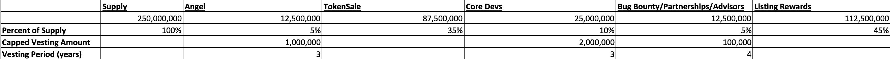

Rex White Paper

# White Paper

## A Decentralized Multiple Listing Service & Real Estate Transaction Application   

**Rex**: referring to the platform, Rex

**REX**: referring to the token, REX

Real property, property defined as anything that is owned by a person or entity that has any interest in land, real estate, or the improvements on it, has existed since man first settled the ancient lands of Mesopotamia in 4500 BCE [4] [6]. Since the ancient settlements there have been two major pieces of a real estate transaction:

1.	Research: Obtaining property data 
2.	Financing & Title: Communication, recording and tracking ownership 

Traditionally, obtaining reliable property information and an accurate chain of title was difficult. Today, with advances in technology, data has become easier to ascertain. However, the data has become controlled, manipulated, and governed by centralized organizations, resulting in exorbitant transaction and listing fees. With recent advances in peer-to-peer data distribution and blockchain technology, Rex will provide universal access to real estate information and streamline the transaction process. 

### Table of Contents

* Today
	* What is a multiple listing service?
	* Breaking down today’s real estate transaction 

* Research, Financing & Title
	* Research: 1.0 & 2.0 Listing Services - Black's Guide, CoStar & Loopnet
	* Financing & Title: Today’s process for transferring title
 
* Blockchain

	* What is a Blockchain?
	* What is Ethereum?
	* Why is Rex building on Ethereum? 

* Data Distribution 
	* Today’s data distribution model
	* Tomorrow’s data distribution model: IPFS & Swarm
	* The benefits to Rex

* Problem & Solution

	1. Research: Expensive real estate data with limited access
	2. Financing & Title: Inefficient communication, high transaction fee’s

* Rex

	* Phases 1-4
	* Model 
	* Token Allocation
	* Token Utility
	* Listing Rewards
	* Verification System
	* Payment Delays 
	* Fee’s
	* Tokensale
	
* Conclusion

* Founder Biographies

## Today

What is a multiple listing service?

A multiple listing service (MLS, also “multiple listing system” or “multiple listings service”), is a suite of services that enables real estate brokers to establish contractual offers of compensation (from brokers), facilitate cooperation with other broker participants, and accumulate and disseminate information to enable appraisals. An MLS also acts as a facility for the orderly correlation and dissemination of listing information to better serve brokers’ clients, landlords, tenants, and the public [5]. A multiple listing service’s database and software are used by real estate brokers and real estate owners to share information about properties with other brokers, owners, buyers, sellers and tenants.

Breaking down today’s real estate transaction:

**Research**

A buyer, tenant or broker searching for a house, office, warehouse, land or retail space typically begins their search with an online MLS such as CoStar, Loopnet, Zillow, or Trend. The accessible data is limited before the user hits a paywall. The paywalls consist of annual memberships that enlist high annual fees and collect superfluous data about their customers and deals. 

**Financing & Title**

After the user subscribes and locates a property, they engage the listing agent to negotiate price. Next, the buyer and seller have their attorneys draft, edit, and finalize the Purchase & Sale Agreement (PSA). Within the PSA are a list of terms the buyer and seller must perform for the transaction to consummate. The buyer is permitted approximately 30-90 days to perform an analysis of the property called due diligence. Due diligence includes, but is not limited to:

1. Structural inspections
2. Electrical inspections
3. Well/septic inspections
4. Roof inspections
5. Environmental inspections 
6. Lien queries
7. Survey 

The buyer’s lender will conduct:

1.	Mortgage origination (qualify the buyer)
2.	Appraisal
3.	Title search

During due diligence, the seller will perform certain obligations spelled out in the PSA:

1. Building repairs
2. Municipal approvals
3. Cure judgments/liens
4. Obtain a certificate of occupancy (if necessary) 

Throughout the transaction, the buyer and seller communicate through their banks, attorneys, inspectors and real estate brokers. The chain of communication inevitably leads to delays and increased costs to the buyer and seller.

Once diligence expires and both sides meet their respected obligations, a closing date is set. The following is a brief list of documents required at closing:

1. 	Closing statement
2. 	Title report
3.	Tax/insurance statements 
4.	Inspection/survey reports
5.	Proof of identity 
6.	Bank statements/authorizations 
7.	Funds

In the US, closing costs average approximately +$10,000 for residential and approximately +$20,000 for commercial (subject to the size of the deal and local tax jurisdictions). 

Hypothetical Example:
Bob wants to sell a mixed use building in Princeton, New Jersey:

* Address: 236 Nassau Street
* Price: $3,500,000
* 9 1-bedroom apartments
* 2 retail units
* Net Operating Income: $175,000
* Capitalization Rate: 5%

**Research**

Bob decides to list 236 Nassau Street on Loopnet.com. After several weeks and no traction, Bob decides to signup for Loopnet's Premium Addition (approximately $299.95/month). Loopnet's Premium Edition grants Bob access to surrounding property data. After three weeks and no action, Bob decides to obtain a Comparable Property Analysis. Bob pays approximately $90.00 for the service. The information is dated and proves useless. Next, Bob realizes 234 Nassau is at the bottom of the search query. For an additional fee, approximately $399.95 for 30 days, Bob can have 236 Nassau Street listed as "Platinum" on the results page. Bob proceeds with the Platinum listing.

Bob is spending approximately $790.00/month on marketing fee’s for 234 Nassau Street.

**Financing & Title**

Alice’s broker finds Bobs listing on Loopnet and presents it to Alice. Alice decides to make an offer of $3,400,000. Bob accepts Alice’s offer and their attorneys negotiate the Purchase & Sale agreement on the following terms:

1.	Alice is to obtain 70/30 financing.
2.	Due diligence period: 60 days.
3.	Closing to take place five days after the due diligence period expires.
4.	Bob must repair the damaged sidewalks and obtain electrical inspections.
5.	Bob must replace the cast iron waste line with PVC. 
6.	Bob must replace the damaged roof shingles. 
7.	Bob’s building must pass a fire inspection.

Alice deposits $175,000 in her attorney’s escrow account. Due to miscommunication between the title agency and bank, closing is delayed two weeks costing both Bob and Alice money in attorney fees and carrying costs.  Finally, a closing date is set, and after several hours of paperwork, title is passed. Title is recorded manually at Princeton’s municipal clerk’s office.  

Alice and Bob paid approximately $40,000 in combined transaction costs and Bob paid approximately $790.00/month in listing fee’s. 

## Research 

Listing Service 1.0 (Pre-Internet) 

Pre-internet, the commercial real estate industry relied on Black's Guide (or alike services) for dependable real estate information. Black's Guide provided a bi-annual paper release of available listings in the northeastern United States. Local markets throughout the world used similar systems to disseminate property information. Content quickly became dated and unreliable. 

Listing Service 2.0 (Post-Internet, Pre-Blockchain)

In the United States, there are two dominant commercial listing providers:

1.	CoStar
2.	Loopnet

Loopnet is a “freemium” commercial platform permitting non-paying subscribers limited access to property information. Loopnet’s fee structure:

- Approximately $299.95/month for up to 10 listings 
- Approximately $399.95/month to list one “Platinum Property” 
- Approximately $90.00 fee to view up to 3 comparable properties

We can approximate that the average Loopnet subscriber is paying at least $30.00/listing per month or $360.00/listing per year: 

    300/10 = 30 

    30 * 12 = 360

Users subscribing to Platinum and Comparable Properties are paying approximately $520.00/listing per month or $6,240.00/listing per year: 

    30+ 400 + 90 = 520.00

    520 * 12 = 6,240.00

Common complaints amongst users include a lack of price transparency, user experience, and dated information [2]. Loopnet limits the amount of data a “non subscriber” can view. Loopnet was recently purchased by CoStar, which now controls the majority of commercial data in the United States. 

CoStar (CSGP) is a publicly traded company located in Washington D.C. CoStar provides the brokerage community with detailed property information including price, type, building size, vacancies, and general market trends through paid research associates. CoStar charges annual fee’s starting at approximately $3,500 per certificate. CoStar operates through a team of researches who contact real estate brokers to obtain and verify listing information. The flaws of the system include:

A. Services: CoStar packages broker deal information into the paid services they offer third party brokers. Knowing this, brokers tend to provide fragmented data to protect long-term individual interests. The conflict is illustrated in the following example: 

Broker A provides CoStar with a recent deal they transacted:

* Tenant: ABC Inc. 
* Size: 20,000/SF Office
* Address: 123 Main Street 
* Term: 5 years
* Price: $25.00/SF Gross

CoStar packages Broker A’s transaction into paid services. Broker B subscribes to the package and views Broker A’s transaction. With an information edge, Broker B solicits the tenant in year four knowing ABC Inc.'s lease expires the following year. Broker A is now competing with Broker B for her own clients business. 

The research model increases overhead with suboptimal results.  

B. CoStar’s audience is limited to the brokerage community. Mostly due to cost, the average buyer/seller doesn’t have access to the data. This excludes a large portion of the market that’s looking to purchase, sell, or lease. In addition, CoStar does not provide title, tax, encumbrance, easement, or environmental reports.  

## Blockchain

What is the Blockchain?

The blockchain is a distributed database or public ledger that gained popularity following the release of Bitcoin. It maintains a continuously growing list of all the transactions in a particular network that have ever been executed. The “blocks” are added in chronological order with cryptography to prevent tampering, thus becoming an indelible record of every transaction in the network and accessible to every participant [1].

What is Ethereum? 

The Ethereum system can be described as a single shared computer that is run by the network of users, on which resources are parceled out and paid for in Ether. In essence, it’s a world computer.

Why is Rex building on Ethereum?

Data needs to be on a server. A server is generally owned or leased by a corporation. Therefore, the individual relinquishes control of their data. 

This leads to increased costs with low accessibility and inoperability. 

We now have the means of decentralizing data. BitTorrent, Swarm, and IPFS can do that on their own, but the blockchain provides the ability to organize and order the data with no central authority. Ethereum provides a means to mesh together the blockchain, data distribution, and currency all under one roof. Ether acts as a convenient medium in which Ether can be exchanged for REX, and REX will fuel the application. This is the absolute value Rex sees for blockchain and Ethereum technology. 

Rex is building on the Ethereum protocol for several reasons. The first is to provide a distributed database where anyone can access real estate information for free. 

Distributed databases provide two advantages:

1.	The user always owns and has access to their information. Third party advertisements, especially those of competing brokers, will never exist on a listees page.
 
2.	Price Stability: No central authority owns the information thus placing capital controls on the data. 

Ethereum also provides a means for tokenized currency. Rex is utilizing the tokenized aspect of Ethereum to reward contributors for providing content. 

Over time, Rex will provide a comprehensible history of each individual parcel. Through the continued use of smart contracts, Rex will introduce escrow, title, and tokenized ownership, while simultaneously compiling the data in an easy to read, traceable format. Ethereum provides the foundation to make this possible. Contracts will be accessible in real time thus providing practical, usable information. An example of this would be a comparable market study based on real time comps.  

## Today’s Data Distribution Model

Since the 90’s, the HTTP protocol has been a useful tool to send and receive data packets from one or more central servers to the requesting node:

Today we distribute much larger packets of information. If too many requests are made servers become overwhelmed. The result is increased latency, downtime, and maintenance requirements. The costs are passed from owner to user. In 2017, the HTTP protocol is inefficient. We’re at an inflection point where nodes no longer need to communicate through centralized routes, but rather, can do so peer-to-peer. 

Tomorrow’s Data Distribution Model:  IPFS/Swarm

IPFS: 

The Interplanetary File System (IPFS) is a new hypermedia distribution protocol, addressed by content and identities. IPFS enables the creation of completely distributed applications. It aims to make the web faster, safer, and more open.

IPFS is a peer-to-peer distributed file system that seeks to connect all computing devices with the same system of files. In some ways, IPFS is similar to the Web, but IPFS could be seen as a single BitTorrent swarm, exchanging objects within one Git repository. In other words, IPFS provides a high throughput content-addressed block storage model, with content-addressed hyperlinks. This forms a generalized Merkle DAG, a data structure upon which one can build versioned file systems, blockchains, and even a Permanent Web. IPFS combines a distributed hashtable, an incentivized block exchange, and a self-certifying namespace. IPFS has no single point of failure, and nodes do not need to trust each other [3].

Swarm:

Swarm is a distributed storage platform and content distribution service. It is a native base layer service of the Ethereum web 3 stack. The primary objective of Swarm is to provide a sufficiently decentralized and redundant store of Ethereum's public records. In particular Swarm stores and distributes Đapp code and data as well as blockchain data. From an economic point of view, it allows participants to efficiently pool their storage and bandwidth resources in order to provide the aforementioned services to all participants.

From the end user's perspective, Swarm is not that different from WWW, except that uploads are not sent to a specific server. The objective is to provide a peer-to-peer storage and serving solution that is DDOS-resistant, has zero-downtime, is fault-tolerant and censorship-resistant, and is self-sustaining due to a built-in incentive system, which uses peer-to-peer accounting and allows trading resources for payment. Swarm is designed to deeply integrate with the devp2p multiprotocol network layer of Ethereum as well as with the Ethereum blockchain for domain name resolution, service payments, and content availability insurance [10].

How IPFS and Swarm can work together: 

According to Viktor Tron, IPFS enables Swarm to redefine itself as a modular system where standard interfaces allow mutually interchangeable components. Swarm offers an operational mode where the retrieval end of the protocol could use the IPFS distributed hash table (DHT) or the default IPFS stack could use Swarm's erasure coding scheme or incentive system [7].

Benefits to Rex:

IPFS and Swarm coupled with Ethereum enables Rex to distribute real estate data across hundreds of nodes with no central server. The result is a low cost solution where users to view real estate information for free. 

## Problem/Solution

Problem

1. Current real estate databases are expensive, inaccessible and inoperable with other applications.

2. Transacting real estate is expensive and time consuming with inefficient communication channels. Banks, lawyers, and title companies charge high fees and delay the process.

Solution

**Research**

A.   Create the global, decentralized real estate database that is interoperable with other applications. Provide free real estate data while paying users for data. 

**Financing & Title**

B.   Provide a secondary layer that will process financial transactions and title. Implement a payment framework where users can sell data to other users keeping the proceeds for themselves. Introduce Tokenized Ownership. 

Rex will scale the database in the research phase. As infrastructure matures and adoption expands, Rex will offer a suite of tools that will enable the user to identity, select, negotiate and pass title all via the Rex engine. 

## Rex

**Model**

Reed Hastings built Netflix with the idea of streamlining the way users view and receive digital content. First, Hastings exercised value out of the existing technological infrastructure. Users rented dvds online and had them physically delivered via US mail thus avoiding the inconveniences of traditional retail (time, travel, and late fees). Netflix grew exponentially as infrastructure matured and delivery went from physical to digital. 

Rex is taking a similar approach. Starting with the foundations laid by Ethereum, IPFS and Swarm, Rex will begin assembling the global real estate database. As the database scales and the network is stable, Rex will introduce transaction services and Tokenized Ownership.

The 4 stages of development

**Phase 1**: Build the global, decentralized, open source real estate database (RexCore). Hash each entry with a Rex Global Identifier (RGID). 

**Phase 2**: Add filtration layer to the database using machine learning and human curation.

**Phase 3**: Introduce real estate transaction services. Begin assigning title utilizing the RGID system. Introduce payment frameworks where users can charge other users for content. 

**Phase 4**: Introduce Tokenized Ownership “liquid real estate”.

Rex is building on a combination of open source libraries under the Web3 umbrella. RexCore and RexCore UI will be open source. Some layers beyond Phase 1 including a polished UI, advanced filtration techniques and user services will be closed source. 

Token Allocation
 

Founders and Angels will have a three year vesting period at no more than 1,000,000 REX a year. This is to ensure price stability amongst the REX token. 

Token Utility (Phase 1-2)

1.	Listing Rewards
2.	Market Sponsorships
3.	Featured Properties
4.	Broker & Landlord Professional Profiles
5.	Custom Market Studies* (user to user)
6.	Architecturals, Inspection & Appraisal Reports* (user to user)

*Architecturals, Appraisals, Inspection Reports and Custom Market Studies will be the first Token Utility feature that allow users to sell data to other users in exchange for REX. The user selling the data will set the price and collect all REX proceeds generated from transaction. Rex will collect a nominal transaction fee. 

Token Utility (Phase 3-4)

1.	Transactional Services (Escrow & Settlement)
2.	Recording 
3.	Tokenized Contracts (RexDex)*

In Phase 4, Rex will introduce Tokenized Ownership. The assets will be traded via Rex’s internal exchange, the RexDex. The REX token will be utilized for trades and settlement services. We will release more information on the RexDex and Tokenized Ownership in the coming months.   
 
**Listing Rewards**  
Listing Rewards provide a distributed means to build and scale the database. Anyone can upload a listing to Rex. Each upload will be eligible for Listing Rewards. Only users who are verified (see verification below) will receive the Listing Reward.  

The initial demand for REX tokens is driven by the following:

1. Professional Profiles: We calculate that for every 100 listings uploaded to REX there will be 1 professional profile created 100:1. 
2. Market Sponsorships: Users can sponsor major markets like New York City, Sydney or Shanghai. 
3. Architecturals, Market/Inspection Reports: Users can sell Inspection and custom Market Reports to other users on the platform. 

Verification System

Rex requires users to register in order to receive the Listing Reward. Listings submitted by users that are not the broker, landlord or seller must provide Proof of Approval* in order to receive the Listing Reward. Rex’s User Rating System will track user reputation. Higher reputations will receive expedited payouts.

Rex will provide Proof of Approvals (PoA) to users submitting listings that are not their own. PoA’s will require evidence from the user that the listing broker or landlord has authorized them to submit listings on their behalf. Listings submitted without PoA’s will not be eligible for the Listing Reward. 

Payment Delay

Rex will have an auto reward for "registered" listee’s with a 1-month payment delay. If they are found to be listing fake listings or listings without PoA’s the listing will be flagged, the users rating will drop precipitously and they will lose their 1-month pending payments. If the user is flagged multiple times the account will be banned. 

Fee’s

Transaction fee’s and REX collected in Phases 2-4 will be sent to the RexDAO contract. In the first 6 months, the fee's will be donated to the Ethereum Foundation. In subsequent years the funds will either be burned to offset inflation or redirected to fund continued development. 

Tokensale

Rex will sell 87,500,000 REX of the total 250,000,000 supply in the tokensale. We are currently reviewing several tokensale models, including the reverse Dutch Auction. We will provide an update as soon as a decision has been made.

### Conclusion

The internet has matured through two major iterations. The first was the creation of the HTTP protocol, static web pages, and content creation and distribution. The second iteration consisted of building applications on top of the HTTP protocol (the transition from content creation by owner to content creation by user i.e. Facebook, Twitter). The third iteration, as Rex sees it, is data democratization. 

We believe your listing data should be free. With today’s advances in storage, bandwidth, distribution and flexible blockchains like Ethereum, we can rebuild the old systems into cost effective platforms. Users will retain real estate data and not become a product of a larger corporation. Users will earn money for data they provide to both the network and other users. Thus, the large corporations will be faced with new competition from their former "users.” 

### Founder Bios

Stephen King

Stephen is an entrepreneur with a focus in commercial real estate and blockchain technology. Since 2013, Stephen has lead King Realty Group in Princeton, New Jersey and participated in tens of millions in real estate transactions. Stephen has participated in the design of several real estate related technology startups. Stephen is the founder of Princeton Ethereum Meetup. 

Russell McLernon 

Russell is the technology strategist. He brings over 15 years of experience in enterprise software development and over 7 years in blockchain related development and projects. Although acutely technical, he has an innate ability to quickly decipher user needs. There's no software development or integration challenge he can't handle.

Contact email: Support@rexmls.com

## Links

Rex Landing Page

http://www.rexmls.com/

Rex Blog Page

http://www.rexmls.com/blog/

## References

1. https://cre.tech/will-sleepy-real-estate-industry-wake-blockchain/

2. http://www.yelp.com/biz/loopnet-san-francisco-2 

3. https://ipfs.io/

4. http://legal-dictionary.thefreedictionary.com/Property+(ownership+right)

5. https://en.wikipedia.org/wiki/Multiple_listing_service

6. http://digitalcommons.law.yale.edu/cgi/viewcontent.cgi?article=1409&context=fss_papers

7. http://www.ibtimes.co.uk/ethereums-viktor-tron-talks-about-swarm-skeleton-web-3-0-1560654

